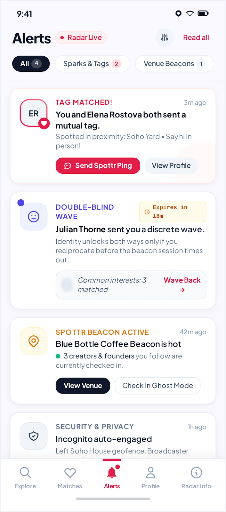
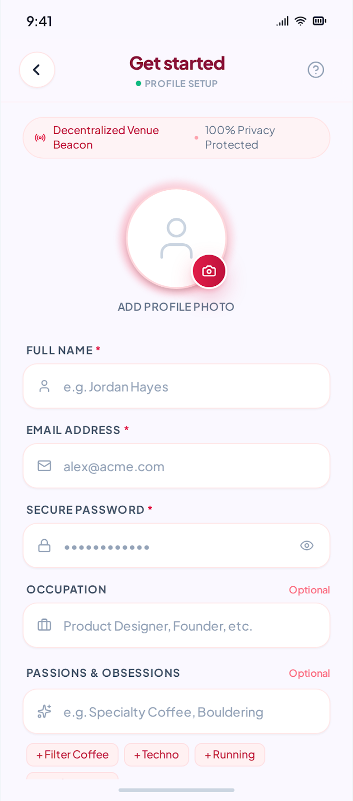
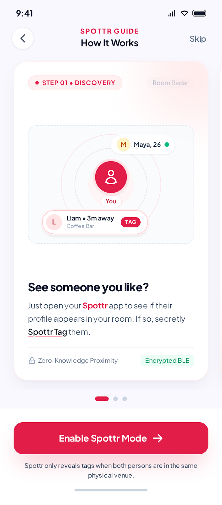
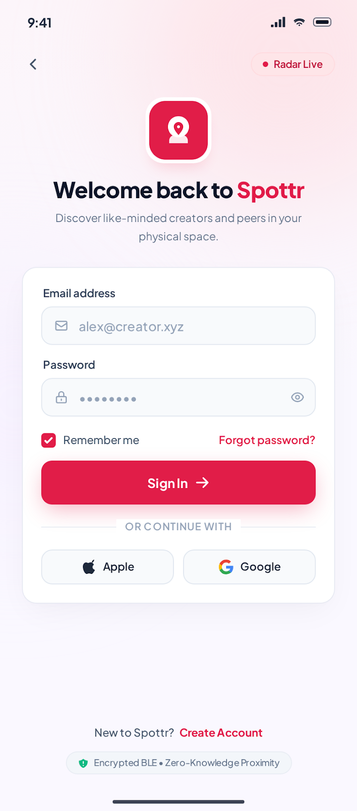
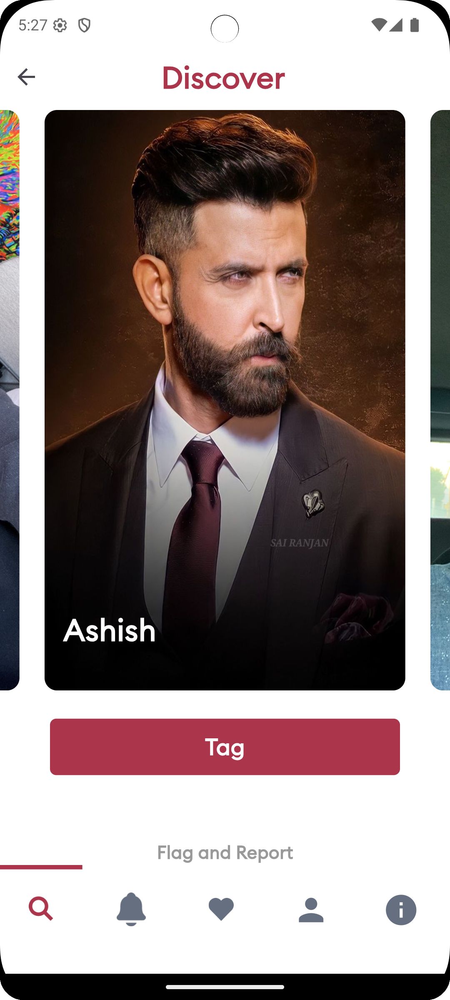
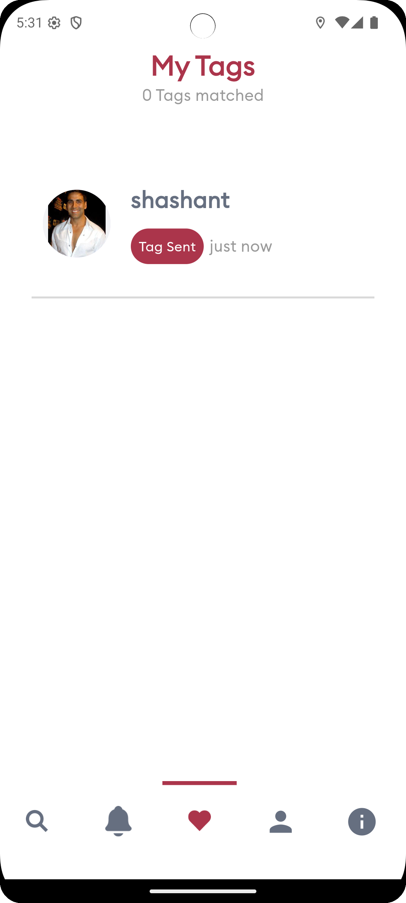
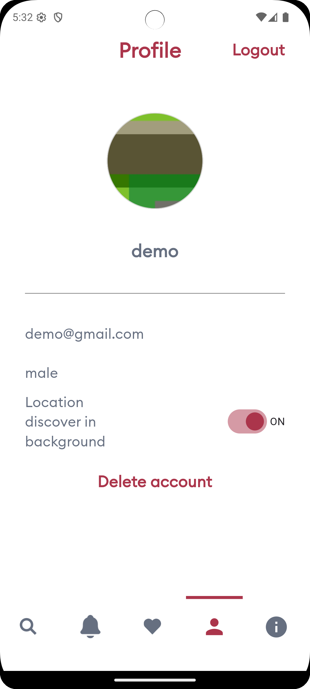
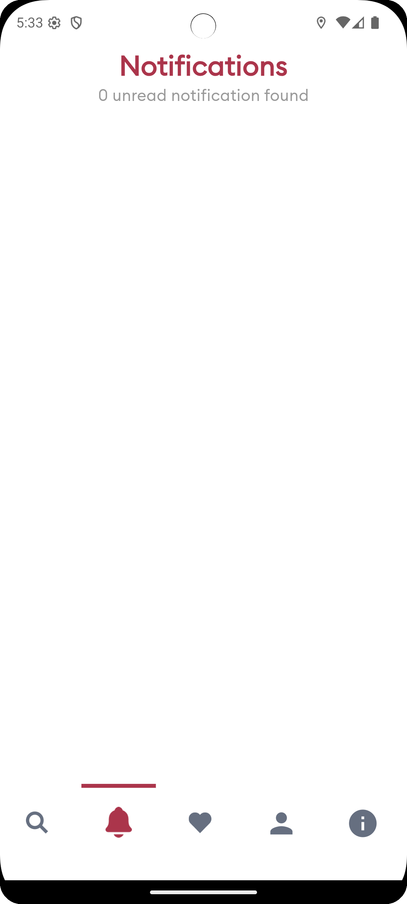
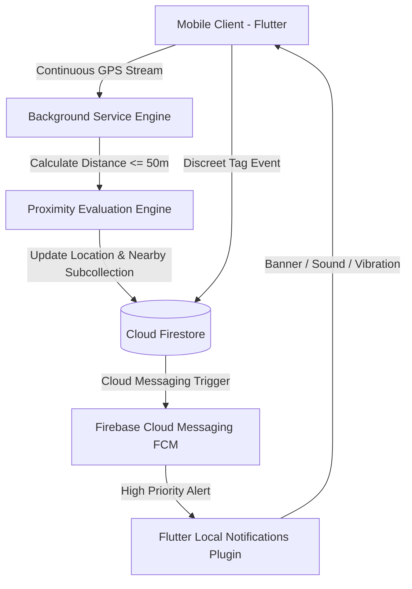

# 📍 TagApp  — Real-Time  Social Discovery Platform

<p align="center">
  
</p>

<p align="center">
  <strong>Connect with people in your physical space within a 50-meter radius in real time.</strong><br/>
  A production-grade, cross-platform mobile application engineered with Flutter, Dart, Firebase, and Background Geolocation Services.
</p>

<p align="center">
  
  
  
  
  
  
</p>

---

## 📌 Executive Summary

**TagApp**  is a cutting-edge hyper-local mobile application designed to
foster spontaneous, real-world networking at conferences, coworking hubs, cafes, and social events.
The app detects nearby users within a strict **50-meter radius** using background location tracking
and the Haversine distance algorithm.

When two people are in close proximity, they can discover each other's profiles, send discreet **"
Tags"**, and connect when interest is mutual—preserving complete user privacy and location
confidentiality until both parties choose to engage.

---

## 🚀 Commercial Track Record & Production Deployment

> [!NOTE]
> **Proven Production Delivery & App Store Releases**
> - **Timeline**: Architected and developed ~2 years ago as a complete end-to-end client contract.
> - **Multi-Platform Deployment**: Successfully compiled, code-signed, and deployed to production on
    both the **Apple App Store (iOS)** and **Google Play Store (Android)**.
> - **Current Store Status**: The client successfully launched and concluded their initial product
    evaluation. Currently, live store listings are archived/inactive as the client decided not to
    renew ongoing developer account subscriptions and cloud hosting.
> - **Portfolio Relevance**: This codebase serves as verifiable proof of end-to-end mobile
    engineering: native iOS & Android build configurations, complex background service execution,
    zero-leak location filtering, real-time Firebase sync, and production release pipelines.

---

## 🌟 Core Features & Capabilities

| Feature                             | Engineering Description                                                                                                                                                  |
|:------------------------------------|:-------------------------------------------------------------------------------------------------------------------------------------------------------------------------|
| **50-Meter Hyper-Local Radar**      | Continuous background geolocation engine that dynamically detects active users within a precise 50-meter radius using the Haversine distance formula.                    |
| **Discreet "Tag" & Mutual Match**   | Send a discreet tag without awkwardness. When both individuals tag each other, a **"TAG MATCHED!"** push notification is dispatched to both parties.                     |
| **Real-Time Cloud Synchronization** | Sub-second Cloud Firestore synchronization populates a dedicated `nearby` subcollection, automatically purging users who walk outside the 50m geofence.                  |
| **Background Location Daemon**      | Integrated headless execution via `flutter_background_service` and `geolocator`, maintaining proximity awareness even when the app is minimized or the screen is locked. |
| **Zero-Knowledge Privacy Controls** | One-tap background location toggle allows users to go incognito (`visible: false`), concealing identity and stopping location broadcasting instantly.                    |
| **FCM Push Notifications**          | High-priority custom notification channels (sound, badges, heads-up display) powered by Firebase Cloud Messaging and Flutter Local Notifications.                        |
| **Rich Profile Cards**              | Displays photos, professional occupations, passions, hobbies, and mutual interests with smooth swipeable navigation.                                                     |

---

## 📱 Visual Showcase & UI Gallery

### 🎨 1. Client Redesign Showcase 

*The updated, modern UI/UX redesign requested by the client, featuring sleek glassmorphism, refined
radar indicators, and intuitive onboarding:*

|                             Screen 1: Alerts & Radar Live                              |                       Screen 2: Profile Setup & Passions                       |                     Screen 3: Interactive How-It-Works Guide                     |                      Screen 4: Welcome & Authentication                      |
|:--------------------------------------------------------------------------------------:|:------------------------------------------------------------------------------:|:--------------------------------------------------------------------------------:|:----------------------------------------------------------------------------:|
|  |  |     |  |
|   **`screen1.png`**<br/>Mutual Tag Match alerts, Double-Blind Waves & Venue Beacons    | **`screen2.png`**<br/>Profile photo upload, occupation & passion tag selector  | **`screen3.png`**<br/>Interactive radar guide with real-time distance indicators |   **`screen4.png`**<br/>Secure sign-in with Google & Apple authentication    |

---

### 📲 2. Production App Implementation

*Screenshots from the live production application deployed to the App Store and Google Play:*

|                              Nearby Discovery Feed                               |                           Tag Sent & Matches                            |                                      Profile & Privacy Controls                                      |                                  Notification History                                   |
|:--------------------------------------------------------------------------------:|:-----------------------------------------------------------------------:|:----------------------------------------------------------------------------------------------------:|:---------------------------------------------------------------------------------------:|
|  |  |  |  |
|           **`home_screen.png`**<br/>Card stack with 1-tap "Tag" button           |         **`tag_sent.png`**<br/>Active sent tags & match tracker         |               **`profile_screen.png`**<br/>Background location switch & GDPR controls                |         **`notification_screen.png`**<br/>Real-time push alert notification log         |

---

## 🛠️ Architecture & Tech Stack



### Technology Highlights

- **Framework**: [Flutter](https://flutter.dev/) (SDK `>= 3.3.0` / Dart 3.x)
- **State Management**: [Provider](https://pub.dev/packages/provider) (Clean MVVM Architecture)
- **Backend & Cloud
  **: [Firebase Core](https://firebase.google.com/), [Cloud Firestore](https://firebase.google.com/docs/firestore), [Firebase Authentication](https://firebase.google.com/docs/auth), [Firebase Storage](https://firebase.google.com/docs/storage)
- **Geolocation & Mapping**: [`geolocator`](https://pub.dev/packages/geolocator), [
  `location`](https://pub.dev/packages/location), [`geocoding`](https://pub.dev/packages/geocoding)
- **Background Execution**: [
  `flutter_background_service`](https://pub.dev/packages/flutter_background_service) with headless
  Android & iOS runners
- **Push Notifications**: [`firebase_messaging`](https://pub.dev/packages/firebase_messaging), [
  `flutter_local_notifications`](https://pub.dev/packages/flutter_local_notifications)
- **Storage & Caching**: [`shared_preferences`](https://pub.dev/packages/shared_preferences), [
  `flutter_cache_manager`](https://pub.dev/packages/flutter_cache_manager)
- **Screen Adaptation**: [`flutter_screenutil`](https://pub.dev/packages/flutter_screenutil)

---

## 🧠 Technical Deep Dive: The 50-Meter Proximity Algorithm

The application computes hyper-local proximity without streaming heavy raw coordinates to
third-party servers:

1. **Continuous Background Polling**: A lightweight background daemon queries device GPS hardware
   every 8–10 seconds.
2. **Haversine Distance Filter**:

```dart

final double distance = Geolocator.distanceBetween(
  currentLatitude,
  currentLongitude,
  targetLatitude,
  targetLongitude,
);
```

3. **Dynamic Presence Engine**:
    - If `distance <= 50.0` meters **and** `target.visible == true`: The user profile is dynamically
      upserted into the current user's `users/{uid}/nearby/{targetUid}` Firestore subcollection.
    - If `distance > 50.0` meters: The profile document is automatically removed from `nearby`,
      keeping the local feed strictly real-time and memory-efficient.
4. **Mutual Match Dispatch**: When User A and User B tag each other within the proximity threshold,
   an automated FCM cloud payload dispatches an alert with a high-priority heads-up banner and
   custom audio.

---

## 📂 Project Structure

```text
tagapp/
├── android/                   # Android native platform code & build configs
│   ├── app/
│   │   ├── google-services.json.example  # Firebase Android template
│   │   └── build.gradle
│   └── key.properties.example # Keystore template
├── ios/                       # iOS native Xcode project & entitlements
│   ├── Runner/
│   │   ├── GoogleService-Info.plist.example # Firebase iOS template
│   │   └── Info.plist         # Location background mode keys
├── lib/                       # Main Dart source code
│   ├── main.dart              # App bootstrap & background service registration
│   └── src/
│       ├── app_routes/        # Named navigation routing
│       ├── modal/             # Data models (User, Notification, Tag)
│       ├── res/               # Colors, typography, constants, reusable widgets
│       ├── service/           # Datastore, FCM notification & Firebase options
│       ├── utils/             # Geolocation helpers & validators
│       └── view/              # MVVM View & ViewModel layers
│           ├── dashboard/     # Discover, My Tags, Alerts, Profile screens
│           ├── login/         # Sign in flow
│           ├── sign_up/       # Registration flow
│           └── splash/        # Animated launch screen
├── screenshots/               # High-resolution screenshots showcase
├── pubspec.yaml               # Dependencies & asset manifests
└── README.md                  # Project documentation & portfolio showcase
```

---

## 🔒 Security & Sensitive Data Protection

This public repository adheres to strict cybersecurity best practices:

- **Zero Secrets Tracked**: All sensitive files (`google-services.json`, `GoogleService-Info.plist`,
  `local.properties`, `key.properties`, and `*.jks` keystores) are excluded via `.gitignore`.
- **Sanitized Configurations**: Example templates (`.example`) are provided so developers can link
  their own Firebase and keystore credentials safely.

---

## ⚙️ Local Development Setup

To run this project locally, follow these steps:

### 1. Prerequisites

- **Flutter SDK**: `>= 3.3.0` (Tested on Flutter 3.22+)
- **Dart SDK**: `>= 3.0.0`
- **Android Studio** / **Xcode**
- A **Firebase Account** with Firestore & Authentication enabled

### 2. Clone the Repository

### 3. Install Dependencies

```bash
flutter pub get
```

### 4. Configure Firebase Credentials

1. **Android**: Copy `android/app/google-services.json.example` to
   `android/app/google-services.json` and insert your Firebase project details.
2. **iOS**: Copy `ios/Runner/GoogleService-Info.plist.example` to
   `ios/Runner/GoogleService-Info.plist` with your iOS app parameters.
3. Or configure automatically using the FlutterFire CLI:

```bash
flutterfire configure
```

### 5. Launch the Application

```bash
# Run on connected device or simulator
flutter run
```

---

## 👨‍💻 About the Author & Freelance Hire

I am **Saklen Khan**, a dedicated **Senior Flutter & Full-Stack Mobile Application Developer**
specializing in building resilient, cross-platform apps with real-time architectures, location-based
services, and intuitive UI/UX.

- 💼 **Available for**: Full-time mobile engineering roles, contract projects, and freelance
  assignments.
- 📱 **Core Competencies**: Flutter, Dart, iOS (Swift/Xcode), Android (Kotlin/Gradle), Firebase,
  Cloud Firestore, Geolocation & Background Daemons, RESTful APIs, State Management (Provider, Bloc,
  Riverpod).

<p align="center">
  <a href="mailto:saklenkhan501@gmail.com">
    
  </a>
  <a href="https://github.com/iamsaklenkhan">
    
  </a>
  <a href="https://www.linkedin.com/in/saklen-khan-flutter-developer">
    
  </a>
</p>

---

## 🏷️ Keywords & SEO

`Flutter Developer` • `Mobile App Engineer` • `iOS & Android Cross-Platform` •
`Location-Based Mobile App` • `50 Meter Proximity Radar` • `Social Discovery App` •
`Real-Time Geolocation` • `Firebase Cloud Messaging` • `Flutter Background Service` •
`Freelance Flutter Developer` • `Upwork Mobile Specialist` • `Fiverr Top Rated App Developer` •
`Dart 3` • `Provider Architecture`
